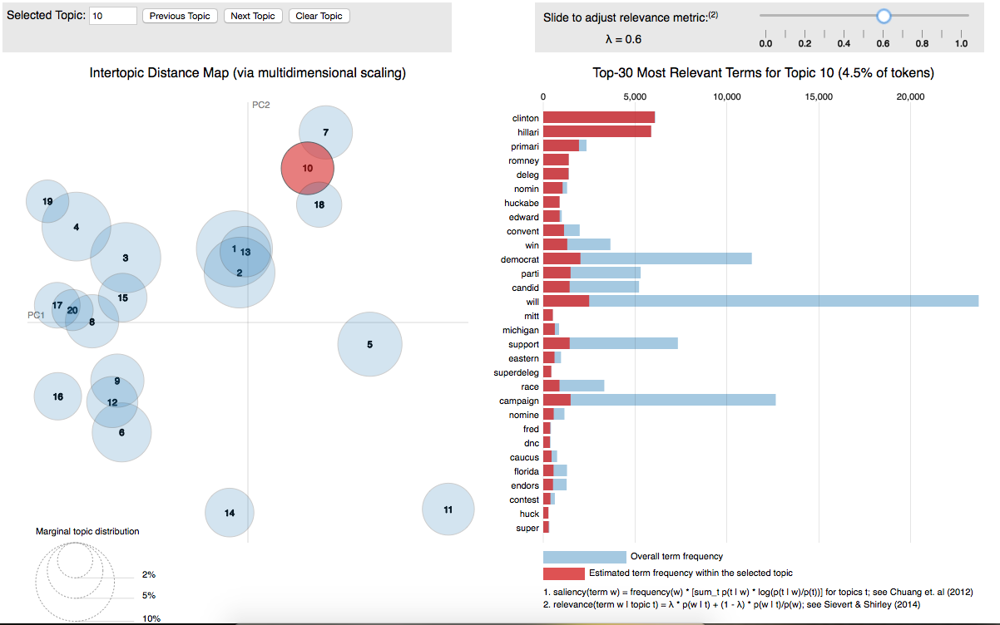

```{r setup, include=FALSE}
knitr::opts_chunk$set(cache=TRUE)
```

# Introduction
This lab offers an introduction to some of the ideas in text analysis.  The code here is not necessarily indicative of best practice- but it is hopefully helpful as a springboard for basic concepts. 

We will primarily be using Ken Benoit's **quanteda** package for text manipulation.  There are several other fantastic options including **corpus**, **tidytext** and **tm**.  **stm** which we will use for topic modeling also has some pre-processing tools. **quanteda** has a great vignette to help you get started ([here](https://cran.r-project.org/web/packages/quanteda/vignettes/quickstart.html)).  Ken also has great exercises available from his [course](http://kenbenoit.net/quantitative-text-analysis-tcd-2016/).

# A Note About Citation
Most of the software packages are written by academics.  Reliable and easy-to-use software is really difficult to make.  If you use these packages in your published work: *please* cite them.  In R you can even see how the author would like to be cited (and get a bibtex entry).
```{r}
citation("quanteda")
```

# Alternate Document Sets
In the folder I've included a number of alternative datasets that you can work with.  **quanteda**, **stm** and the **mnir** package also have a number of additional text sources.  Even better- use your own!

# Preparation
We start with data downloaded from JSTOR's Data For Research ([DFR](http://dfr.jstor.org/)) database.  I've pulled the abstracts for all articles published in the American Journal of Sociology (AJS) and American Sociological Review (ASR) for the years 1975-2013.  DFR limits data pulls to 1000 documents at a time, so there are five tab-separated files we'll be working with.  These files are in a .zip file at the following [link](scholar.princeton.edu/files/bstewart/files/dfr.zip)

First, load some of the general packages.

```{r warning=FALSE, message=FALSE}
library(tidyverse)
library(quanteda)
```

# Pre-processing Text

For each of the JSOTR data pulls, there is a citations.tsv file that has the tab-separated citation information of each document, including the text of the article's abstract. 

Unfortunately, the format of the .tsv contains a trailing tab -- so annoying with tab-delimmeted data. So we need to read in the data and the column names separately or R gets too clever and we end up with mismatched names and data.  To make this easier, we provide the following function to load in the data.  There is often some annoying thing you need to do to get your data loaded into R.
```{r}
# load ASR data
getJournalCites <- function(file.loc) {
  #
  col.names <- unlist(read.delim(file.loc, header=F, stringsAsFactors = F, nrow=1))
  cites <- read.delim(file.loc, header=F, stringsAsFactors = F, skip=1) 
  # remove the trailing column, and any without abstracts
  cites <- select(cites, -14)
  names(cites) <- col.names
  cites <- filter(cites, nchar(abstract)>0)
  cites$year <- format(as.Date(cites$pubdate), "%Y")
  return(cites)
}

# load each in turn
ajs.cites <- getJournalCites("data/ajs_1997_2013/citations.tsv")
ajs.cites.2 <- getJournalCites("data/ajs_75_96/citations.tsv")
asr.cites <- getJournalCites("data/asr_1997_2013/citations.tsv") 
asr.cites.2 <- getJournalCites("data/asr_85_96/citations.tsv") 
asr.cites.3 <- getJournalCites("data/asr_75_84/citations.tsv") 

# package into a single data frame
cites <- rbind(ajs.cites, ajs.cites.2, asr.cites, asr.cites.2, asr.cites.3)
cites$doc_id <- paste(cites$author, cites$year) #let's make a variable to identify it
```

Take a look at the data frame you just produced.  For small to medium sized document collections (let's say less than a million documents), this "spreadsheet" format is often the easiest way to work with data.

The [quanteda](https://cran.r-project.org/web/packages/quanteda/quanteda.pdf) package contains some great tools for easily processing a set of documents into the document-term matrix numerical representation we'll use. First, we construct a **corpus** object from the loaded data. We'll use the "id" field for **docnames** instead of the "title" field because titles are not 100% unique in these data.  The **docvars** option lets us bring in other document metadata we'd like to have available with the corpus later.
```{r warning=FALSE, message=FALSE}
corpus <- corpus(cites, 
                 docid_field="doc_id", 
                 text_field="abstract")
summary(corpus,3)
```

Next, we transform the **corpus** into a **document feature matrix** (also called a document-term matrix, document-token matrix, or document-word matrix) where each row is a document (article) and each column is a distinct term.  As we'll see below, this object can be used in many places as a document-term matrix. The dfm() has an option **verbose=** that defaults to $TRUE$; turning this to $FALSE$ will mask the following output.
```{r}
mydfm <- dfm(corpus, remove=stopwords("english"), remove_punct=TRUE)
```

We can also remove rare terms.  The advantage of this trimming is that each word is a dimension in the vector representation of each document.  Thus, we remove a lot of *dimensions* from our data without losing very much *information*.  Setting **verbose=TRUE** provides us with some useful information about the number of features that were removed.
```{r}
mydfm <- dfm_trim(mydfm, min_count = 5, min_docfreq = 3, verbose = TRUE)
```

# Quick Overviews
Quanteda makes it easy to get quick overviews of your data. The first simple summary is the most frequently occuring words.  This is often a good first check that something hasn't gone horribly wrong.  For example, when first preparing this, I forgot to remove punctuation and many pieces of punctuation were the most frequent terms.

```{r}
topfeatures(mydfm, 10)
```

A fun way of summarizing your text is with a word cloud package.  quanteda can do this for us as well.  Under the hood, quanteda is calling the [wordcloud](https://cran.r-project.org/web/packages/wordcloud/wordcloud.pdf) R package to do the magic.

```{r}
set.seed(48109)
textplot_wordcloud(mydfm, min.freq = 6, random.order = FALSE,
                   rot.per = .25, max.words=50,
                   colors = RColorBrewer::brewer.pal(8,"Dark2"))
```


A tremendously useful technique is Key Words In Context (KWIC),  This let's you know that what you are guessing about how a word is used is actually right.
```{r}
kwic(corpus, "nuance*", window=3)
kwic(corpus, phrase("causal inference"), window=3)
```

#Comparisons by Group
Often in the social sciences we care about contrasts in language between one group and another.  The following code sums over the relevant grouping variable.  

```{r}
group_dfm <- dfm(corpus, remove=stopwords("english"), remove_punct=TRUE,
             groups="journaltitle")
group_dfm[,1:10]
```

By adding **comparison=TRUE** we can now plot a word cloud that compares the groups in our dataset.
```{r}
set.seed(48109)
textplot_wordcloud(group_dfm,max.words=50,
                   colors = RColorBrewer::brewer.pal(8,"Dark2"),
                   comparison=TRUE)
```


# Simple Cluster Identification: K-means
We are going to analyze this corpus using the $k$-means algorithm.  $k$-means is the most popular (and arguably important) flat clustering algorithm.  Its objective is to minimize the average squared Euclidean distance of documents from their cluster centers where a cluster center is defined as the mean or centroid $\overrightarrow{\mu}$ of the documents in a cluster $\omega: \overrightarrow{\mu}(\omega) = \frac{1}{|\omega|}\sum_{\overrightarrow{x} \in \omega} \overrightarrow{x}$ (Manning, Raghavan and Schutze, 2008, 360). 

The $k$-means algorithm uses a random initialization.  In order to get the same results each time we will set the random seed.  We will need to rerun this code immediately before executing the model if we want to guarantee the same results.  

```{r}
set.seed(12345)                            
```

Obviously we can try other seeds to see if we get different results.

The kmeans() function in R takes three relevant inputs: our data matrix (input)) our k or the
number of clusters we are looking for and the number of starts. The number of starts will initialize
the algorithm with however many random starting points the user requests. Then it displays the
results with the lowest residual sum of squares. If your computer is running slowly you can 
decrease the number of starts.

For the purposes of this exercise to make this run faster we are going to really aggressively trim down the size of the documents.
```{r}
mydfm <- dfm_trim(mydfm, min_count = 50, min_docfreq = 25, verbose = TRUE)

```

In addition to generating clusters for 10, let's compare that to 5 clusters.  Also, let's see if subsequent runs of kmeans produces similar clusters.

**Code runtime interlude**: What's [k-means](https://en.wikipedia.org/wiki/K-means_clustering) doing?  ?
```{r}
kmeans.results.10 <- kmeans(mydfm, centers = 10, nstart = 3) 
```

The **cluster** element of these results objects has a cluster number for each of the documents in our corpus.  Of course, simply looking at this list gives us very little indication of what's going on.

```{r}
head(kmeans.results.10$cluster)
```

## Labeling Clusters: Distinguishing Words

Cluster labels (or topic names) can be generated automatically, but you should *always* manually read a sample of documents as well.

The guiding principle behind automatic labelling of clusters is to find those words that best characterize the cluster.  Any automatic labeling strikes a balance between finding words that are *representative* of the cluster but also *distinguish* the cluster from others.  The words we identify should minimize the surprise when we read the documents after viewing the labels.  The variance-weighted log-odds ratio developed by Monroe et al. in "Fighting Words" is a very useful tool for ranking the words within clusters in order to generate labels.

First, we need a function, **clusterFightingWords** to calculate the cluster-specific variance-weighted log-odds of each term.
```{r}
# dfm -- a quanteda document-term object
# clust.vect -- a boolean vector the same length of dfm, where TRUE indicates a member of the focal cluster
# alpha.0 -- the strength of the prior, expressed as number of terms per sub-corpus 
clusterFightinWords <- function(dfm, clust.vect, alpha.0=500) {
  # we need to get the overall corpus word distribution and the cluster-specific words dists
  # y_{kw} in Monroe et al. 
  overall.terms <- colSums(dfm)
  # n and n_k in Monroe et al. 
  n <- sum(overall.terms)
  # alpha_{kw} in Monroe et al. 
  prior.terms <- overall.terms / n * alpha.0
  # y_{kw}(i) in Monroe et al.
  cluster.terms <- colSums(dfm[clust.vect, ])
  # n_k(i) in Monroe et al.
  cluster.n <- sum(cluster.terms)
  
  cluster.term.odds <- 
    (cluster.terms + prior.terms) / 
      (cluster.n + alpha.0 - cluster.terms - prior.terms)
  overall.term.odds <- 
    (overall.terms + prior.terms) / 
      (n + alpha.0 - overall.terms - prior.terms)
  
  # usually, we'd hate to blindly log something, but as long as we have a non-zero prior, 
  # these will both be non-zero.  
  log.odds <- log(cluster.term.odds) - log(overall.term.odds)
  
  variance <- 1/(cluster.terms + prior.terms) + 1/(overall.terms + prior.terms)
  
  # return the variance weighted log-odds for each term
  return(log.odds / sqrt(variance))
}
```

We also need a function, **clusterLabels** that can call **clusterFightingWords** for each cluster and package the results into a tidy set of labels.
```{r}
# dfm -- a quanteda document-term object
# results -- a k-means results object
# n.terms -- the number of terms to include in the label
clusterLabels <- function(dfm, results, n.terms=10) {
  clusters <- length(results$withinss)
  labels <- rep("", clusters)
  for (clust.num in 1:clusters) {   
    clust.vect <- results$cluster==clust.num
    terms <- clusterFightinWords(dfm, clust.vect)
    terms <- order(terms, decreasing = T)[1:n.terms]
    # use the terms as indices on the features list of the dfm
    labels[clust.num] <- paste(colnames(dfm)[terms], collapse=", ")
  }
  return(labels)
}

# In case we want to print tidy versions of the labels.  
# I don't use this here, but sprintf() is super useful to know.
printLabels <- function(labels, results){
  for (clust.num in length(labels)) {
    # sprintf() is a little wonky, but a super powerful tool for formatting your text output
    cat(sprintf("%2i) %5.0f Members | %s", 
                  clust.num, 
                  sum(results$cluster==clust.num),
                  labels[clust.num] 
          )
    )
  }
}
```

Now that we've functions defined to do the heavy lifting, it's easier to compare our different clusterings.  Note that the numbering of the clusters might be different even if clusters are very similar.  

First, let's look at our three 10-cluster runs:
```{r}
  clusterLabels(dfm=mydfm, results=kmeans.results.10, 10)
```

Do these labels make sense to you?  Try it again with different numbers of clusters.

### Cluster-level word clouds  

We can also get a high-level view of the cluster content by building a word cloud of just the documents in the cluster.  Note that there will use the raw counts of words, rather than pulling out the words that most specifically apply to the cluster of interest.  It won't be surprising if words like "social" appear in most of the word clouds for these docs.  Instead of what words set this cluster apart, like our fightin' words label provides, the word clouds show how prevelant words are within the cluster, taken in isolation.
```{r warning=F}
textplot_wordcloud(mydfm[kmeans.results.10$cluster==1,], max.words=30)
```

## Reading Documents

Once we label something, we have a habit of letting that label stand in for the thing that it labels.  It's important, before we get too attached to any labeling of a set of documents, to confirm that what we infer from the *label* is equivalent to what we infer from teh *documents*.

Let's grab the cluster labels for our first 10-cluster solution and a few abstracts from each cluster and see how they compare. 
```{r}
labels <- clusterLabels(mydfm, kmeans.results.10, 10)
# add cluster numbers to the corpus documents
corpus$documents$cluster <- kmeans.results.10$cluster
```

Let's make a convenience function for displaying a sample of docs from a given cluster.
```{r}
printCorpusCluster <- function(corpus, clust.num, num.docs, labels) {  
    print(labels[clust.num])
    cluster.corpus <- corpus_subset(corpus, cluster==clust.num)
    # sample some docs from the cluster sub corpus
    cluster.docs <- texts(cluster.corpus)[sample(x=1:nrow(cluster.corpus$documents), num.docs)]
    return(cluster.docs)
}
```

And look at how these compare to some of the labels

```{r}
printCorpusCluster(corpus, 1, num.docs=3, labels)
```

## Visualizing Clusters with Covariates of Interest
We might want to see how the two journals compare in terms of the clusters of documents.

```{r}
  corpus$documents$cluster <- kmeans.results.10$cluster
  labels <- clusterLabels(mydfm, kmeans.results.10, 3)
  # package the labels into a lookup dataframe so it can be merged into the corpus and used in the graph
  label.df <- data.frame(cluster=1:length(labels), cluster.name=labels)
  corpus$documents %>%
    left_join(label.df) %>%
    ggplot() +
      geom_bar(aes(x=cluster.name, fill=journaltitle), position="dodge", width=0.75) +
      xlab("Cluster") +
      ylab("Number of Articles") +
      # the labels are loooonnnngggg, so rotate them 45 degrees
      theme(axis.text.x=element_text(angle=45, hjust=1))
```


# Topic Models
This section introduces the [Structural Topic Model (stm)](https://cran.r-project.org/web/packages/stm/index.html) package. Most of it is drawn directly from the [package's Vignette](https://cran.r-project.org/web/packages/stm/vignettes/stmVignette.pdf), which goes through these and other features in even greater depth. I'll also show how to fit a topic model using standard LDA through the Mallet package's Gibbs sampling algorithm.

We're going to be working with Eisenstein and Xing's (2010) corpus of political blog posts from 2008. This will give us two covariates of interest: the *liberal*/*conservative* rating and the *day* during 2008 the blog was published.

## Preprocessing Data

We start by loading **stm** and the dataset.  The **textProcessor()** function will use the **tm** package's text processing tools to stem and remove stop words in the documents.  It will return the documents divided into the **documents**, **vocab**, and **meta** formats that we saw working with the poliblog5k sample.  Check ?textProcessor for options, as it allows you to change stemming options, alter the language used for stop word identification, or even pass in your own custom stop word list.
```{r warning=F}
library(stm)
library(data.table)
poliblog <- as.data.frame(data.table::fread("poliblogs2008.csv"))
# default: removes stop words in english, stems words, removes words under 3 characters, puts everything to lower case
processed.docs <- textProcessor(poliblog$documents, metadata = poliblog)
str(processed.docs, list.len=10)
```

As we saw above, we often want remove the rarer words from our corpus so the algorithm can focus on words that occur in many different documents.  The **prepDocuments()** function will do that for us. The **plotRemoved** function will let us preview how many documents, words, and tokens we'll remove by setting the threshold number of documents to various levels.  
```{r warning=F}
# let's look at 0 to 1% of the documents (130)
plotRemoved(processed.docs$documents, lower.thresh = seq(1, 130, by = 5))
```

It looks like the majority of the words this trims out are removed at around a threshold of 20 documents.  We'll go with that.  

**prepDocuments** will handle reindexing the vocabulary and the metadata as words are removed.  This is a royal pain to do by hand--shoulders of giants here.

```{r}
prepped.docs <- prepDocuments(processed.docs$documents, 
                     processed.docs$vocab, 
                     processed.docs$meta,
                     lower.thresh = 20)
```

## Interlude: Know Your (Meta) Data

Let's take a quick look at the metadata in our dataset: the blog from which the post comes,  and the day the post was made.
```{r}
# Which blogs are which?
table(prepped.docs$meta$blog, prepped.docs$meta$rating)
# Conseratives and Liberals over time
table(prepped.docs$meta$rating, round(prepped.docs$meta$day/30, 0))
# Blogs over time
table(prepped.docs$meta$blog, round(prepped.docs$meta$day/30, 0))
```

## Fitting a Structural Topic Model

The **stm** function does the really heavy lifting, fitting a topic model to our data.  There are more advanced settings for altering the Bayesian prior or the initialization algoritms used, but I'm going to focus on just a handful of features in this lab.

**K** sets the number of topics.  As we'll discuss in lecture, and as covered in the readings, choosing this is an important part of choosing a model.  

Several of the options are worth mentioning/discussing here: 

1. The overall *topic prevalence* (the percentage of a random docuemnt representing each possible topic) can be modeled as a function of covariates of the document.  Here, we use the **R** model specification idioms to make it dependent on the **rating** (partisanship) of the blog author and a spline function of the day, **s(day)**, which will allow the overall topic prevalence to change over the course of 2008.  

2. The **content =~** term would allow us to set a single categorical variable over which the word distibution of topics can be allowed to vary.  In this case, we might allow each of the six different authors to speak about the same topic using slightly different distributions of words. We're going to skip over this feature for this lab, but you can find out more about it in the various STM papers by Roberts et al.  If you do explore it, keep in mind that it can have very large impacts on your model and requires that each category for which you want to allow separate content estimates contain a fairly large number of documents.

3. **max.em.its** tells **stm** the maximum number of iterations to use in the EM algorithm before giving up on it ever converging.

4. **init.type="Spectral"** tells stm to initialize the EM algorithm using the spectral decomposition of the term co-ocurrence matrix.  The spectral initialization uses a deterministic algorithm to find the best starting point for STM's main EM algorithm.  In many of the computational and human-judged ways that we'd want to compare models, it tends to produce better models than a random initialization.  

```{r message=F, eval=F}
poliblog.fit <- 
  stm(prepped.docs$documents, 
      prepped.docs$vocab, 
      K = 20, # number of topics
      prevalence =~ rating + s(day),  
      max.em.its = 75,
      data = prepped.docs$meta, 
      init.type = "Spectral")
save(poliblog.fit, file="poliblog_fit.Rdata")
```
```{r, echo-F}
load("poliblog_fit.Rdata")
```

## Model Overview

The first step in exploring the topic model result is to see what's going on in the topics so that we can start to get a sense of what features of the corpus they might reflect.  

Calling **plot.STM()** on the fit object will show us the topics and their relative shares at a glance. 
```{r}
plot.STM(poliblog.fit)
```

### Content of Topics

Of course, these three-word labels don't give us much insight into the model.  Let's dig into two of the topics to see what's going on.  

The **labelTopics** command will give us the top 7 words (by default) of each topic, using four different metrics for ranking the top words.  If we'd included a content covariate, then we'd need to call **sageLabels(poliblog.fit)** to get the same information; it would average across the content groups to give both overall word lists for each topic and a word list for each content covariate category within each topic.

Prob ranks words by their raw prevalence in the topic, frex takes the harmonic mean of raw prevalence and exclusivity. Score is taken from the **lda** package and lift comes out of the multinomial inverse regression we looked at last week.  

Personally, with this model (on this corpus), I find the FREX (frequency/exclusivity) lists to be the most useful.  When we look at LDAVis below, this is similar to what the lambda slider does to the word lists.

```{r}
labelTopics(poliblog.fit)
```

### Reading Representative Documents

STM will also help us call up representative documents to read to make sure our topics mean what we think they mean.  The **findThoughts()** function will pull up the top *n* documents associated with each topic.

```{r}
# our readable document text is buried in the $meta object, and stored as a factor
doc.text <- as.character(prepped.docs$meta$documents)
sample.docs <- findThoughts(poliblog.fit, 
                            texts = doc.text, 
                            n = 3, 
                            topics = c(1,3,11))
# the first topic we grabbed: 1, Obama
sample.docs$docs[[1]]
# the second topic: 3, meta-media
sample.docs$docs[[2]]
# and the third topic: 17, McCain
sample.docs$docs[[3]]
```

### Wordclouds

As before, we can also use word clouds to get snapshot overviews of our topics of interest.

```{r}
cloud(poliblog.fit, topic=1) 
cloud(poliblog.fit, topic=3)
cloud(poliblog.fit, topic=17)
```

### Comparing Topic Vocabularies

It can also be illustrative to directly compare topics of interest in terms of their vocabulary to make sure that what we think are the distinguishing characteristic of each actually do distinguish them.  **plot.STM()** has a plot **type="perspectives"** that does exactly this.

```{r}
plot.STM(poliblog.fit, type="perspectives", topics=c(3,11))
```

Those two are pretty uninteresting because of how much the two candidates dominate them. How about topic 20: bush-presid-admin and topic 4: democrat-senate-republican?
```{r}
plot.STM(poliblog.fit, type="perspectives", topics=c(4,20))
```

If we had run our model with a content covariate, then calling **plot.STM(..., type="perspectives")** with a single topic number would have let us see how different context categories talk about that topic differently.

### Interactive Model Overview: LDAvis() 

Finally, [Sievert and Shirley's (2014)](http://nlp.stanford.edu/events/illvi2014/papers/sievert-illvi2014.pdf) LDAvis package is an excellent tool for taking a high-level tour of your topic model's output.

Each topic will be represented by a circle whose size is determined by the topic's overall prevalence.  It uses a multi-dimensional scaling algorithm to place the topics using KL-divergence in their distributions over words.  What this means is that topics that are close to one another in the display have more similar words than topics that are far apart.  

On the right is a list of the top 30 (by default) terms overall.  If you click on a topic, it will update this list to the top 30 in the topic selected, and show you the frequency of the word in the topic as well as in the corpus as a whole.  By default, the order of these lists is determined by the raw word freqeucies.  In the upper right is a slider for lambda, which will allow you to trade off the weight between raw word frequecnies in a topic (lambda = 1) and adjusting for the overall word frequency (lambda = 0). The authors recommend (based on testing with human coders) a value of 0.6 for most uses.

Setting **out.dir = ""** will output the  javascript and html neceessary to run LDAvis to the directory you specify.  You can also leave this term out and it will just run as a local server in the "viewer" of RStudio.  

```{r, eval=F}
toLDAvis(poliblog.fit, 
         docs=prepped.docs$documents, 
         out.dir = "poliblog_LDAvis")
```
image: 

## Investigating Covariate/Topic Relationships

**estimateEffect** and **plot.estimateEffect** are tools in STM for investigating how our topics relate to covariates of interest.  

The first step is estimate model effects from our fit object.  The **estimateEffect** function takes a formula (we need to specify which topics as the outcome variable), the model fit to predict from, the meta data, and the type of uncertainty estimate to use.  The default uncertainty setting, "Global," incorporates topic proportion uncertainties into the displayed uncertainty estimates.  

We'll run this using the same formula with which we fit the model so we can recover both the rating and time dimensions.

```{r}
fit.effects <- estimateEffect(1:20 ~ rating + s(day), 
                              poliblog.fit, 
                              meta = prepped.docs$meta, 
                              uncertainty = "Global")
```

### Binary Categories

We could first get an overview of the topics on the liberal-conservative dimension.
```{r}
plot.estimateEffect(fit.effects, 
                    covariate = "rating", 
                    topics = 1:20,
                    model = poliblog.fit, 
                    method = "difference",
                    cov.value1 = "Liberal", cov.value2 = "Conservative",
                    xlab = "More Conservative ... More Liberal",
                    main = "Effect of Liberal vs. Conservative",
                    xlim = c(-.1, .1), 
                    labeltype = "frex", # use stm's "frex" to rank top words
                    n = 3, # only list the top 3 words
                    verbose.labels = F, # labels get spammy with this T
                    width = 35 # allow for longer label strings
                    )
```

Interesting that the "meta-media" topic, 3, is the furthest partisan.  Perhaps this is because one of the blogs in particular most often writes about television broadcasts?

We can run a new **estimateEffect** where we look at variation in just this topic by the blog name. Note that we can use a different model in **estimateEffect** than we fit in **stm**.  That let's us look at how topic prevelance varies by a covariate, even if that covariate was not part of our model structure.

```{r}
blog.effects <- estimateEffect(c(3) ~ blog, 
                              poliblog.fit, 
                              meta = prepped.docs$meta, 
                              uncertainty = "Global")
plot.estimateEffect(blog.effects, 
                    covariate = "blog", 
                    topics = 3,
                    model = poliblog.fit, 
                    method = "pointestimate",
                    verbose.labels=T)
```

As we get closer to publishing, we probably want to clean up our graph and add custom labels using the **labeltype = "custom"** feature of **plot.estimateEffect**.
```{r}
plot.estimateEffect(fit.effects, 
                    covariate = "rating", 
                    topics = c(1, 10, 18, 13, 17, 20),
                    model = poliblog.fit, 
                    method = "difference",
                    cov.value1 = "Liberal", cov.value2 = "Conservative",
                    xlab = "More Conservative ... More Liberal",
                    main = "Topic Prevalence Liberal vs. Conservative",
                    xlim = c(-.1, .1), 
                    labeltype = "custom",
                    custom.labels = c('Obama', 'Israel', 
                                      'Immigration',
                                      'Hillary Clinton',
                                      'McCain/Palin',
                                      'Bush'))
```


### Continuous Covariates

We can also plot against a continuous variable (such as the "day" variable in poliblog) using **method = "continuous"**.  
```{r}
plot.estimateEffect(fit.effects, 
                    covariate = "day", 
                    method = "continuous", 
                    topics = c(1,17),
                    model = poliblog.fit, 
                    printlegend = TRUE, 
                    xlab = "Time (2008)")

```

### Interactions in Prevalence Covariates

This looks a lot like the conservative/liberal frequency graphs we saw when using poliblog for supervised learning -- although it's Topic 1 (Obama) that maps to the conservative frequency and Topic 17 (McCain) that looks like the liberal frequency.  

To investigate that further, we want to allow prevalence to change not only over time and by liberal/conservative, but allow those two categories to have different temporal patterns in prevalence. STM allows us to specify this as a possibility by setting an interaction in the prevalence formulation the same way we would in a regression model.  Running this with "Global" uncertainty can take awhile, so here we'll run just a couple of topics of interest.

First, we fit the **estimateEffects** for the interaction formulation.

```{r message=F, exec=F}
interact.effects <- estimateEffect(c(1,17) ~ rating * s(day), 
                       poliblog.fit, 
                       metadata = prepped.docs$meta, 
                       uncertainty = "Global")
```

Then we can take a look at Topic 1
```{r}
plot.estimateEffect(interact.effects, 
                    topics = 1,
                    covariate = "day", 
                    model = poliblog.fit, 
                    method = "continuous",
                    moderator = "rating", 
                    moderator.value = "Liberal", 
                    linecol = "blue",   
                    printlegend = F)
plot.estimateEffect(interact.effects, 
                    topics = 1,
                    covariate = "day", 
                    model = poliblog.fit,
                    method = "continuous", 
                    moderator = "rating", 
                    moderator.value = "Conservative", 
                    linecol = "red", 
                    add = T,
                    printlegend = F)
legend(150, .02, c("Liberal", "Conservative"), lwd = 2, col = c("blue", "red"))
```

So the Topic 1 differences isn't driving the overall difference in liberal-conservative frequency we observed.  How about Topic 17?
```{r}
plot.estimateEffect(interact.effects, 
                    topics = 17,
                    covariate = "day", 
                    model = poliblog.fit, 
                    method = "continuous",
                    moderator = "rating", 
                    moderator.value = "Liberal", 
                    linecol = "blue", 
                    printlegend = F)
plot.estimateEffect(interact.effects, 
                    topics = 17,
                    covariate = "day", 
                    model = poliblog.fit,
                    method = "continuous", 
                    moderator = "rating", 
                    moderator.value = "Conservative", 
                    linecol = "red", 
                    add = T,
                    printlegend = F)
legend(0, .14, c("Liberal", "Conservative"), lwd = 2, col = c("blue", "red"))
```

So, Liberal blogs appear to rapidly increase their discussion of McCain in the second half of the year.

# Scaling


In this Lab, we'll look at two methods for scaling documents or authors in a unidimensional spatial model.  Wordscores and Wordfish both seek to extract a single latent dimension of each text author that we consider to be motivating the author's word choice.  Wordscores is a supervised approach, requiring us to specify the pair or set of training documents that will define the dimension.  Wordfish is an unsupervised approach that will extract a latent dimension, though as we'll see, it's not always the dimension we're interested in.

We'll also take a brief look at correspondence analysis, a method that will allow us to fit a multi-dimensional model to a set of documents.

We'll be using the [quanteda](https://cran.r-project.org/web/packages/quanteda/index.html) package for most of the work herein -- it contains implementations of Wordscore, Wordfish, Naive Bayes, and Correspondence Analysis.  

```{r}
library(quanteda)
```

## Wordscores

We'll start with the simple, non-parametric Wordscores approach.  

First, let's take a look at U.S. presidential inaugural speeches during the 20th Century.  The full corpus of speeches in included in the quanteda package. 

```{r}
summary(data_corpus_inaugural)
# let's look at 20th- and 21st-century presidents
inaug.dfm <- dfm(corpus_subset(data_corpus_inaugural, Year>1901), remove_punct=TRUE)
```

For Wordscores, we need to specify at least two anchors that will form the end points of our single-dimension reduction of the data. Let's start with Roosevelt's 1937 speech our left-most and Reagan's first speech our right-most points.
```{r}
docnames(inaug.dfm)
# so, we want the 9th document and the 20th
# scores tells wordscores the end points of the scale
fit <- textmodel_wordscores(inaug.dfm[c(9,20)],y=c(-1,1))

# Then we can apply our fitted model to the full data set
word.scores <- predict(fit, newdata=inaug.dfm)
# see below regarding the "@" symbol
ws.data.frame <- word.scores@textscores
ggplot(ws.data.frame, aes(x=rownames(ws.data.frame), y=textscore_raw)) +
    geom_errorbar(aes(ymin=textscore_raw_lo, ymax=textscore_raw_hi), width=.1) +
    geom_point() +
    theme(axis.text.x=element_text(angle=45, hjust=1))
```

Note the message from **predict** that only a subset of the features can be scored when we run predict.  This means that only that subset of words appears in one of the training documents -- the remaining words in the feature set appear in other documents, but not the two we train on.

It's likely that wordscore will put a lot of emphasis on words that appear in one of the training docs, but not in the other.  In our case, each doc has ~450 words, but they only share 245 out of the 682 total between them.

```{r}
# distinct words in Roosevelt
sum(as.numeric(inaug.dfm[9,])>0)
# distinct words in Reagan
sum(as.numeric(inaug.dfm[20,])>0)
# distinct words in both
sum(as.numeric(inaug.dfm[20,])>0 & as.numeric(inaug.dfm[9,])>0)
# distinct words in either
sum(as.numeric(inaug.dfm[20,])>0 | as.numeric(inaug.dfm[9,])>0)
```

### Side Note: the "@" Symbol

Above, we accessed the results from Wordscore using the @ symbol instead of the usual $ in **word.scores@textscores**.  Many R objects are built with S3, which mimics some of the properties of an object-oriented class system.  However, when full class functionality is required, the objects are built in S4 (deployed through the **methods** package).  S3 objects (which include lists and data.frames) use the $ notation, while S4 objects use the @.  If you're more interested in the differences between the two approaches, [this presentation](http://www.ci.tuwien.ac.at/Conferences/useR-2004/Keynotes/Leisch.pdf) by Friedrich Leisch offers a good orientation.

### Varying the End Points

Let's see what happens if we pin down the speeches with other end points.  Maybe there was something idiosyncratic about this pair.

This is going to be easier to try out different endpoints if we wrap the call in a function.
```{r}
wordScoreMe <- function(df, indices, y=c(-1,1)) {
  fit <- textmodel_wordscores(df[indices,], y=y)
  
  # Then we can apply our algorithm to the full data set
  word.scores <- predict(fit, newdata=df)
  ws.data.frame <- word.scores@textscores
  ggplot(ws.data.frame, aes(x=rownames(ws.data.frame), y=textscore_raw)) +
      geom_errorbar(aes(ymin=textscore_raw_lo, ymax=textscore_raw_hi), width=.1) +
      geom_point() +
      theme(axis.text.x=element_text(angle=45, hjust=1))  
}
```

And now we can easily produce the scaled graph for different end points.

```{r}
# how about the first roosevelt speech and second reagan?
wordScoreMe(inaug.dfm, c(19,20))
# reagan and obama?
wordScoreMe(inaug.dfm, c(27,21))
```

Each time, we see the same pattern: our two specified end points (training documents) are placed at the extremes, and everything else clusters close to zero.  This is being driven in part by two things that point to the sort of corpuses spatial models will work better with.  

### Wordscore With Lots of Data

First, these documents are relatively short for each author, such that we get a small amount of overlapping words between them.  This gives the models little to work with in pulling a dimension of difference out, and we'll tend to emphasize the small set of things that distinguish the particular pair (or in the case of Wordfish, the single outlier, as we'll see below).  What Wordscores is essentially doing is ranking documents by how similar they are to the training documents at either end of the spectrum. Try it out with a larger dataset.


### Wordscores with a Narrow Discourse

The other issue is that although these Presidents are all speaking at the same formal event, they are potentially talking about very different things.  Maybe there's not enough consistency in topical focus across the inauguration speeches to map them into a single dimension.  If we have a very narrow scope of potential discourse, then we may be more likely to find a reliable mapping to a single dimension even without lots of words per author.  We've seen one example of such a narrowly-proscribed set of documents: the 2010 set of budget speeches by Irish parliamentary leaders used in Lowe and Benoit (2013).

```{r}
summary(data_corpus_irishbudget2010)	
# let's fix up the doc names so they'll fit on graphs
new.ie.corp <- data_corpus_irishbudget2010
docnames(new.ie.corp) <- paste0(new.ie.corp$documents$party, "_", new.ie.corp$documents$name)
ie.dfm <- dfm(new.ie.corp)
docnames(ie.dfm)
```

Let's start by pinning down our dimension to the endpoints that Wordfish identified (in Lowe and Benoit (2013)): FF's Cowen (document 5) and Labor's Burton (document 3).

```{r}
wordScoreMe(ie.dfm, c(3,5))
```

Okay, now we're getting somewhere.  The very narrow scope of a particular budget debate means that even with relatively short texts, we're able to capture the split between government (FF and Green) and the opposition.  As in their paper, though, Sinn Fein is quite close to the middle, despite having been human-coded as the most extreme.  

How does it look if we pin down on the human-coded extremes?

```{r}
# Sinn Fein's O'Caolain
wordScoreMe(ie.dfm, c(14,5))
# Sinn Fein's Morgan
wordScoreMe(ie.dfm, c(4,5))
```

Clearly choice of end points can make a large difference in the spatial positions of authors -- great care needs to be taken to validate both the stability of the results and the interpretation that the dimension mapped represents some theoretical dimension of interest.

## Wordfish

Wordfish is a fully unsupervised model for scaling a set of documents (or individuals) on a single dimension without having to specify what that dimension is.  Since we know from Lowe and Benoit what Wordfish should produce with the Irish budget speeches, let's start with them.

Rather than specifying the end points, we only need to specify the orientation -- choosing one document to be "less than" another.  **textmodel_wordfish()** (in **quanteda**) will default to the first and second document if we don't specify a pair.  


```{r}
wf.fit <- textmodel_wordfish(ie.dfm)
summary(wf.fit)
```

We'll have to pull out the elements for our plot one at a time.  To make it easier to reproduce, let's put together a function that will go from model to plot.  To do so, we'll need to extract the features we want into a data.frame using the S4 notation

```{r}
wordFishMe <- function(df) {
  wf.fit <- textmodel_wordfish(df)
  wf.df <- data.frame(name=wf.fit@docs,
                      theta=wf.fit@theta,
                      se=wf.fit@se.theta)
  
  ggplot(wf.df, aes(x=name, y=theta)) + 
        geom_errorbar(aes(ymin=theta - 1.96 * se, 
                          ymax=theta + 1.96 * se), 
                      width=.1) +
        geom_point() +
        theme(axis.text.x=element_text(angle=45, hjust=1))  
}
```

And then run it for the Irish budget speeches from Lowe and Benoit.
```{r}
df <- data.frame(word = wf.fit@features, psi=wf.fit@beta)
head(arrange(df, psi), n=20)
head(arrange(df, desc(psi)), n=20)
wordFishMe(ie.dfm)
```

Alright, so we look like Lowe and Benoit's results -- including placing the most anti-budget human-coded Sinn Fein in the very center of the score dimension.  

Let's see if Wordfish does any better with our inauguration speeches than Wordscore did.  
```{r}
wordFishMe(inaug.dfm)
```

We're able to pull out a lot more variation than we were with Wordscores.  However, the meaning of the dimension isn't entirely clear. There's a definitive pre-war, intra-war, and post-war split, so one hypothesis might be that we are capturing a temporal dimension.  The three discontinuities map to the shift to radio broadcast with Roosevelt and then television broadcast with Kennedy so that might be it as well.

Maybe if we narrow our scope to post-Eisenhower, we'll be able to recover a political dimension?
```{r}
inaug.post.war <- dfm(corpus_subset(data_corpus_inaugural, Year>1960))
wordFishMe(inaug.post.war)
```

Two things are worthy of note here.  First, the pattern still appears to be primarily temporal -- this time mapping to a Cold-War and post-Cold-War inaugurations.

Interestingly, the relative pattern between the included presidents is similar to what we saw between them when fitting the full set. This may be coincidence, or it may indicate that we're not pinning down what's driving positioning within this dimension. 

## Multiple Dimensions

Rather than imposing a uni-dimensional spatial model on the data, correspondence analysis can allow us to pull out a multi-dimensional spatial model from the texts.  The [ca](https://cran.r-project.org/web/packages/ca/index.html) package implements this approach. This lab will implement a simple two-dimension CA.  To find out more about running it with larger number of spatial dimensions, check out the [ca documentation](https://cran.r-project.org/web/packages/ca/ca.pdf).  Conveniently, **quanteda** has a wrapper function for **ca** as well.  

```{r}
# set the number of dimensions (nd) to 2
wca <- textmodel_ca(inaug.dfm, nd = 2)
```

We can compare our first dimension to the dimension produced using word fish to see that the two are highly correlated. 
```{r}
wf.fit <- textmodel_wordfish(inaug.dfm)
plot.df <- data.frame(wordfish = wf.fit@theta,
                      ca.dim1 = wca$rowcoord[,1],
                      ca.dim2 = wca$rowcoord[,2],
                      name = wf.fit@docs)
ggplot(plot.df, aes(x=wordfish, y=ca.dim1, label=name)) +
  geom_text(hjust=0) +
  geom_point()

cor(wf.fit@theta, wca$rowcoord[,1])
```

So, our first dimension in CA is *mostly* picking up the same dimension as Wordfish.  What is our second dimension getting?

```{r}
ggplot(plot.df, aes(x=ca.dim1, y=ca.dim2, label=name)) +
  geom_text(hjust=0) +
  geom_point()
```

Taftness and Hardingness.  Let's zoom in on the people who aren't defining a dimension and see how Taftness and Hardingness map into what we know about them
```{r}
ggplot(plot.df, aes(x=ca.dim1, y=ca.dim2, label=name)) +
  geom_text(hjust=0) +
  geom_point() +
  xlim(-1,1.1) + ylim(-0.8,0.8)
```

# Attribution
This draws on material prepared by Clark Bernier.
